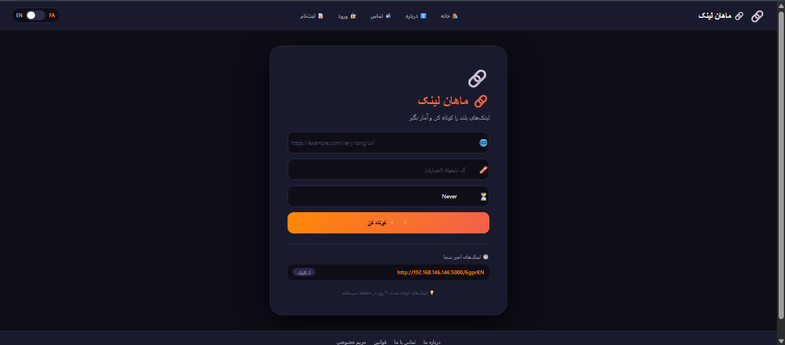
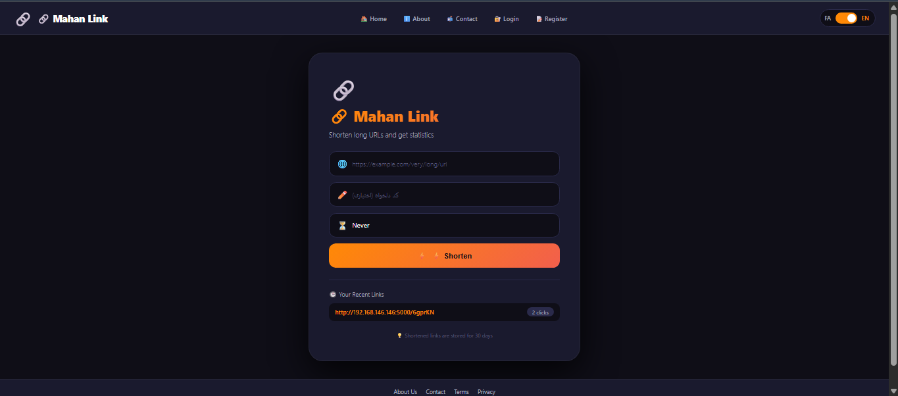

<div align="center">

# 🔗 Mahan URL Shortener

[](https://www.python.org/)
[](https://flask.palletsprojects.com/)
[](LICENSE)

</div>

---

## 📌 Project Introduction

**Mahan URL Shortener** is a complete and professional web application for shortening URLs with advanced features.

> **Note:** This project was built by a 14-year-old developer (Mahan).

---

## ✨ Features

- 🔗 Shorten URLs with random or custom codes
- ⏰ Set expiration dates for links
- 👤 User registration and login system
- 📊 Dashboard to manage links
- 📈 Complete statistics with daily and country charts
- 📱 QR Code generation for each link
- 🌍 Bilingual support (Persian & English)
- 📱 Fully responsive design

---

## 📸 Screenshots

### 🇮🇷 Persian Version


### 🇬🇧 English Version


---

## 🛠️ Technologies

| Technology | Description |
|------------|-------------|
| Flask 2.3.3 | Python web framework |
| SQLAlchemy 3.1.1 | ORM for database management |
| Flask-Login 0.6.3 | User authentication |
| QRCode 7.4.2 | QR Code generation |
| Pillow 10.4.0 | Image processing |

---

## 📥 Installation

### Prerequisites
- Python 3.10+
- pip
- git

### Setup Steps

**1. Clone the Project**
```bash
git clone https://github.com/MahanWebAcademy/url-shortener.git
cd url-shortener
pip install -r requirements.txt
python run.py
